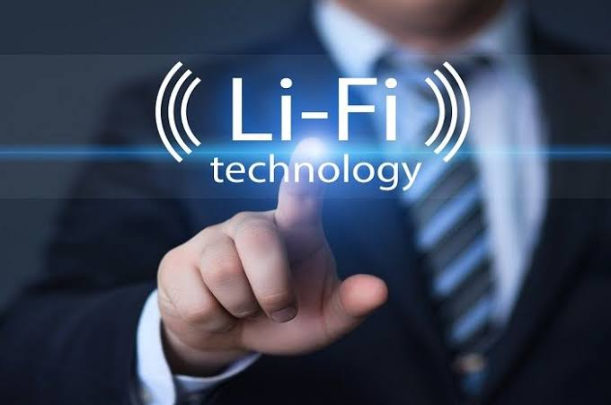
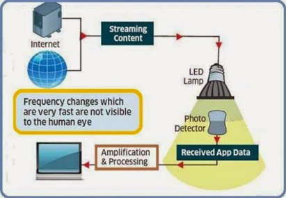

# Li-Fi (Light-Fidelity)

 Light Fidelity merupakan teknologi komunikasi nirkabel dua arah yang berkecepatan tinggi dan mirip dengan teknologi Wi-Fi.

Li-Fi memanfaatkan lampu LED untuk mentransfer data pada spektrum cahaya tampak. Sementara Wi-Fi atau _Wireless Fidelity_ , menggunakan gelombang elektromagnetik pada frekuensi radio untuk mengirimkan data melalui router Wi-Fi. Perbedaan antara keduanya beragam, yang paling jelas adalah Wi-Fi menggunakan gelombang radio, sedangkan Li-Fi memanfaatkan cahaya.

LiFi dirancang untuk menggunakan bola lampu LED yang serupa dengan yang saat ini digunakan di banyak rumah dan kantor yang sadar energi. Namun, lampu LiFi dilengkapi dengan chip yang memodulasi cahaya untuk transmisi data optik. Data LiFi ditransmisikan oleh lampu LED dan diterima oleh fotoreseptor seperti pada Gambar.

## 

### referensi :
[Link](https://id.m.wikipedia.org/wiki/Li-Fi)
# Header 1
## Header 2
### Header 3

- Bulleted
- List

1. Numbered
2. List

**Bold** and _Italic_ and `Code` text

[Link](url) and 
